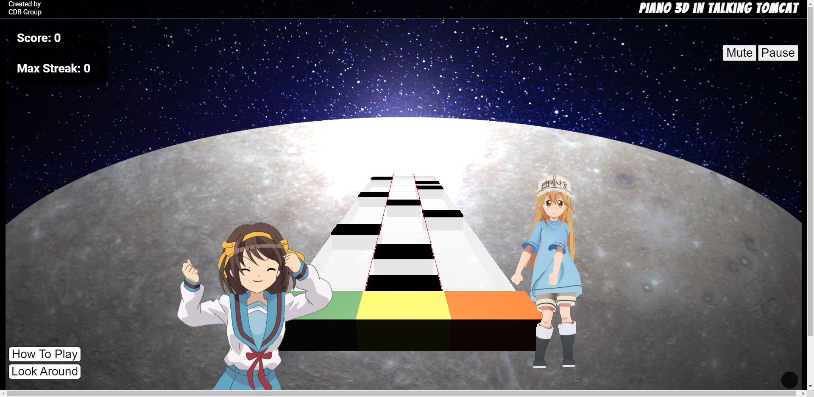
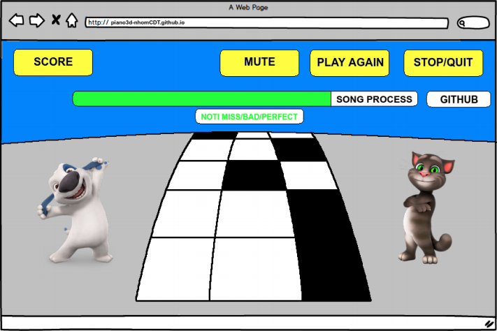

# PIANO 3D (Powered by JavaScript + Three.js)

## Thông tin nhóm

#### Tên nhóm: Nhóm CĐT

#### Thành viên nhóm:

| Tên | MSSV | SĐT | Mail |
| ------------ | ------------- | ------------- | -------------|
| Nguyễn Hoàng Chiến | 1712301 | 0965584075 | 1712301@student.hcmus.edu.vn |
| Võ Văn Đạt | 1712337 | 0981652761 | 1712337@student.hcmus.edu.vn |
| Phạm Hoàng Nhật Thông | 1712171 | 0908363752 | 1712171@student.hcmus.edu.vn |

## Thông tin đề tài

### Tổng quan
PIANO 3D là một game âm nhạc, người chơi dùng các tổ hợp phím để chọn đúng các note nhạc vào đúng lúc để được điểm tùy vào sự chính xác của note nhạc và sẽ được chơi với các level khó hơn.

#### Chức năng
Người chơi sẽ được thực hiện:
* Chọn bài nhạc để bắt đầu chơi
* Click các phím để chơi các note nhạc vào đúng khoảng thời gian nhất định
* Sẽ được báo noti khi chọn đúng/sai note vào các mức độ thời gian (Miss/Bad/Perfect + Streak)
* Button “Play Again" + “Mute Song" + “Quit/Stop Song"
Project sẽ bao gồm:
* Link tới các thành viên trong nhóm
* Bảng hướng dẫn cách chơi game
* 3D animation sử dụng Three.js

### Chi tiết

#### Giao diện
Game sẽ được thể hiện toàn bộ trên 1 trang chức component canvas bao gồm các note nhạc, các button hỗ trợ, các status nhạc, score được thể hiện qua hình sau:

#### Kiến trúc game
Project sẽ apply các công nghệ sau:
* Vanilla JavaScript - tạo cấu trúc và game logic
* Three.js - DOM manipulation và rendering
* AWS S3 cho hosting các bài nhạc

## Timeline để thực hiện

### Day 1 - 3:
* Nghiên cứu Three.js
* Setup cơ bản các file webpack, index.html, entry.js
* Setup scene, camera dựa trên Three.js và làm cho các note nhạc có thể “chạy" từ
trên xuống

### Day 4 - 7:
* Tìm hiểu về logic game:
* Thời gian người chơi click phím match với thời gian của note nhạc trong game
* Tạo các khung thời gian của các note cho người chơi click

### Day 8 - 10:
* Hoàn thành logic game* Thêm các bài nhạc vào game
* Tạo series các note của 1 bài nhạc và render theo thứ tự bằng Three.js

### Day 11 - 13:
Xây dựng các components hỗ trợ cho người chơi:
* Bảng điểm
* Thời gian chạy bài nhạc
* Thông báo Miss/Bad/Perfect + Streak
* Tạo các button (Play Again, Stop/Quit, Mute) cho game
* Hoàn thành xong game và xử lý các lỗi xảy ra trong quá trình build game

### Day 14:
* Testing tất cả các chức năng và hoàn thành “trang trí" cho sản phẩm

## Các chức năng nâng cao có thể phát triển cho game:
* Điều chỉnh mức độ khó, tốc độ của bài hát
* 5 note nhạc thay vì 3 note nhạc
* Cho phép người chơi tự upload bài hát và tự động tạo note cho bài hát đó
* Online battle giữa các người chơi
